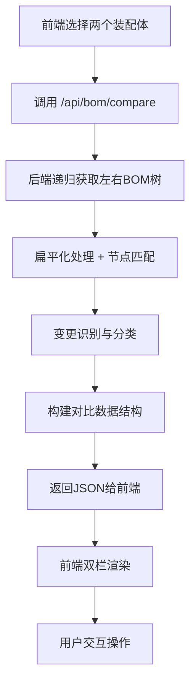
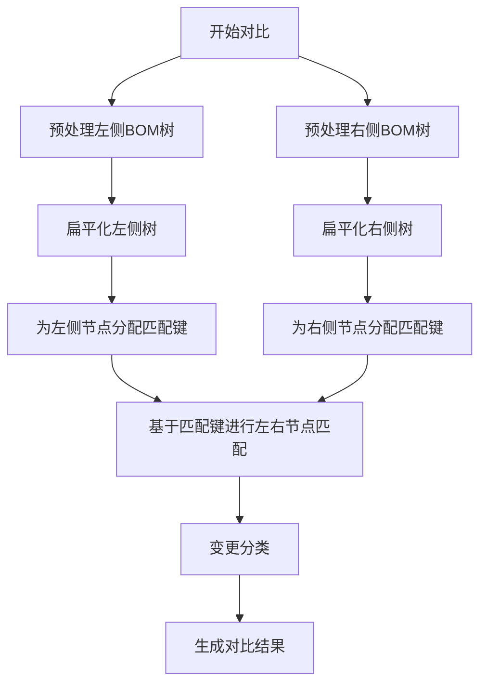

# BOM对比功能详细设计说明书

**文档版本：** v1.4  
**制定日期：** 2026年4月20日  
**最后更新：** 2026年4月20日（根据开发进展更新）  
**制定人：** 国军  
**依据文档：** 《BOM版本对比功能规划文档.docx》

## 1. 现状分析与差距评估

### 1.1 现有BOM对比功能（基于代码审查）
| 功能点 | 当前实现 | 规划文档要求 | 差距分析 |
|--------|----------|--------------|----------|
| 对比界面 | 简单列表（可能单栏） | 双栏可视化对比 + 中缝提示 | 需完全重构界面布局 |
| 变更识别 | 无自动识别 | 自动识别增、删、改、内部变更 | 需实现对比算法 |
| 层级展示 | 可能仅展示直接子项 | 全层级树形展开/折叠 | 需递归获取BOM树 |
| 操作功能 | 可能仅有刷新 | 全展/全收、只显变更、定位、导出 | 需新增操作工具栏 |
| 视觉规范 | 无特殊着色 | 按变更类型着色（4种颜色） | 需实现CSS样式系统 |
| 导出功能 | 无 | 支持Excel/PDF导出 | 需集成导出库 |

### 1.2 技术栈确认
- **前端**：原生JS单页应用（index.html + pages.js），无框架，支持localStorage
- **后端**：FastAPI + PostgreSQL，已存在装配体、零件、BOM项相关API
- **数据库**：`assemblies`（装配体）、`parts`（零件）、`bom_items`（BOM关系）

### 1.3 关键字段确认
- `assemblies.version`：装配体版本字段，String(32)，默认"V1.0"
- `bom_items` 无版本字段，通过 `parent_id` 关联装配体
- 装配体唯一键：`code`（唯一），不支持同一编码多版本
- **结论**：对比功能需基于两个不同装配体记录（不同ID）实现

## 2. 系统架构设计

### 2.1 整体数据流


### 2.2 模块划分
| 模块 | 职责 | 技术实现 |
|------|------|----------|
| **对比算法模块** | 递归获取BOM树、扁平化、节点匹配、变更识别 | Python + SQLAlchemy + 递归CTE |
| **API网关模块** | 接收对比请求、参数验证、调用算法、返回结果 | FastAPI + Pydantic |
| **前端对比组件** | 双栏界面、同步滚动、展开/折叠、高亮着色 | 原生JS + CSS Grid |
| **操作工具栏组件** | 提供全展/全收、过滤、定位、导出等功能 | 原生JS + 事件委托 |
| **导出服务模块** | 生成Excel/PDF格式对比报告 | xlsx + jsPDF + html2canvas |

## 3. 后端API详细设计

### 3.1 对比接口 `POST /api/bom/compare`
**请求体**：
```json
{
  "left_assembly_id": "uuid",
  "right_assembly_id": "uuid",
  "options": {
    "ignore_quantity": false,
    "max_depth": 10,
    "include_internal_change": true
  }
}
```

**响应体**：
```json
{
  "left_assembly": { "id": "...", "code": "...", "name": "...", "version": "..." },
  "right_assembly": { "id": "...", "code": "...", "name": "...", "version": "..." },
  "comparison": [
    {
      "key": "L1-S001-P1001",          // 匹配键：层级-排序号-物料号
      "level": 1,                      // 层级深度（0-based）
      "sort": "001",                   // 排序号（三位字符串）
      "change_type": "none",           // none/add/delete/modify/internal
      "left": {
        "id": "uuid",                  // BOM项ID（左侧）
        "child_type": "part",          // 子项类型：part/component
        "child_id": "uuid",            // 子项实体ID
        "quantity": 2.5,               // 数量
        "detail": {                    // 子项详细信息
          "code": "P1001",
          "name": "螺栓",
          "spec": "M10x30",
          "version": "A",
          "status": "released"
        }
      },
      "right": {
        "id": "uuid",                  // BOM项ID（右侧）
        "child_type": "part",          // 可能为空（当change_type=add）
        "child_id": "uuid",
        "quantity": 2.5,
        "detail": { ... }
      }
    }
    // ... 更多节点
  ],
  "summary": {
    "total_nodes": 45,
    "added": 3,
    "deleted": 2,
    "modified": 5,
    "internal_changes": 1,
    "unchanged": 34
  }
}
```

### 3.2 辅助接口 `GET /api/assemblies/{id}/tree`
**用途**：获取单个装配体的完整BOM树（递归），用于调试和独立使用。

**响应体**：返回树形结构，便于前端展示单个BOM。

### 3.3 数据库优化方案
1. **递归CTE查询**：
```sql
WITH RECURSIVE bom_tree AS (
  SELECT 
    0 as level,
    '' as path,
    bi.*,
    p.code as child_code,
    p.name as child_name,
    p.spec as child_spec
  FROM bom_items bi
  LEFT JOIN parts p ON bi.child_type = 'part' AND bi.child_id = p.id
  WHERE bi.parent_type = 'assembly' AND bi.parent_id = :assembly_id
  
  UNION ALL
  
  SELECT 
    bt.level + 1,
    bt.path || '-' || bt.child_id::text,
    bi.*,
    p.code as child_code,
    p.name as child_name,
    p.spec as child_spec
  FROM bom_items bi
  JOIN bom_tree bt ON bi.parent_type = bt.child_type AND bi.parent_id = bt.child_id
  LEFT JOIN parts p ON bi.child_type = 'part' AND bi.child_id = p.id
)
SELECT * FROM bom_tree ORDER BY path;
```

2. **索引优化**：
```sql
CREATE INDEX idx_bom_items_parent ON bom_items(parent_type, parent_id);
CREATE INDEX idx_bom_items_child ON bom_items(child_type, child_id);
```

## 4. 对比算法设计

### 4.1 算法流程图


### 4.2 匹配键生成规则
```
匹配键 = 层级(level) + ":" + 排序号(sort) + ":" + 物料号(code)
```
- **层级**：从装配体根节点开始的深度（0-based）
- **排序号**：同级节点中的顺序号，三位数字（001, 002, ...）
- **物料号**：零件或装配体的编码（唯一业务标识）

### 4.3 变更识别规则
| 条件 | 变更类型 | 说明 |
|------|----------|------|
| 左侧有节点，右侧无节点 | delete | 右侧删除该节点 |
| 左侧无节点，右侧有节点 | add | 右侧新增该节点 |
| 左右都有节点，detail完全一致 | none | 无变更 |
| 左右都有节点，detail部分字段不同 | modify | 内容修改（数量、规格等） |
| 左右都有节点，detail一致但子项变化 | internal | 内部变更（子项增删改） |

**注意**：`internal`变更需要递归对比子节点后才能确定。

## 5. 前端界面设计

### 5.1 页面布局（CSS Grid）
```css
.bom-compare-container {
  display: grid;
  grid-template-areas:
    "left-selector toolbar right-selector"
    "left-table middle-table right-table"
    "footer footer footer";
  grid-template-columns: 1fr auto 1fr;
  grid-template-rows: auto 1fr auto;
  height: 100vh;
}
```

### 5.2 双栏表格设计
| 左侧表格 | 中缝 | 右侧表格 |
|----------|------|----------|
| 层级缩进 | 变更图标 | 层级缩进 |
| 物料编码 | 变更类型 | 物料编码 |
| 物料名称 | 提示信息 | 物料名称 |
| 规格 | 数量对比 | 规格 |
| 版本 | 操作按钮 | 版本 |
| 状态 | 展开/折叠 | 状态 |

### 5.3 视觉规范（严格遵循规划文档）
| 变更类型 | 背景色 | 前缀图标 | 说明 |
|----------|--------|----------|------|
| 无变更 | #FFFFFF | 无 | 白色背景，无特殊标记 |
| 新增 | #E6F4EA | + | 浅绿色背景，左侧占位 |
| 删除 | #FDEDED | - | 浅红色背景，右侧占位 |
| 修改 | #FFFBEB | ✏️ | 浅黄色背景，双侧高亮 |
| 内部变更 | #FFF3E0 | ? | 浅橙色背景，展开后显示子项变更 |

### 5.4 交互功能设计
1. **展开/折叠**：
   - 每行左侧显示 ▶（折叠）或 ▼（展开）图标
   - 点击图标切换该节点下所有子节点的显示状态
   - 折叠时显示子节点变更统计，如 `[+3 -2]`

2. **同步滚动**：
   - 左右表格的垂直滚动条同步
   - 鼠标悬停某行时，对侧对应行高亮显示

3. **过滤功能**：
   - "只显示变更"开关：隐藏所有`change_type=none`的行
   - 按变更类型筛选：复选框选择显示哪些类型

4. **定位功能**：
   - "上一个变更"/"下一个变更"按钮
   - 滚动到对应行并添加闪烁动画（3次黄色闪烁）

## 6. 操作工具栏设计

### 6.1 工具栏布局
```
[左版本选择] [操作按钮组] [右版本选择]
[全展开] [全折叠] [只显变更] [上一个] [下一个] [导出] [刷新]
```

### 6.2 按钮功能说明
| 按钮 | 功能 | 快捷键 |
|------|------|--------|
| 全展开 | 展开所有层级 | Alt+E |
| 全折叠 | 折叠所有层级 | Alt+C |
| 只显变更 | 切换过滤模式 | Alt+F |
| 上一个变更 | 定位到上一个变更行 | ↑ |
| 下一个变更 | 定位到下一个变更行 | ↓ |
| 导出报告 | 打开导出菜单 | Alt+X |
| 刷新对比 | 重新获取数据 | F5 |

### 6.3 导出菜单
```
导出菜单：
├─ Excel格式
│  ├─ 完整对比报告（含所有节点）
│  └─ 仅变更汇总（只含变更节点）
├─ PDF格式
│  ├─ 打印优化版（适合打印）
│  └─ 详细报告版（含完整数据）
└─ CSV格式（简化数据）
```

## 7. 实施计划（第一阶段细化）

### 7.1 本周任务（4月20日-4月24日）
| 日期 | 任务 | 产出物 |
|------|------|--------|
| 4/20 | 完成详细设计文档 | 本文档 |
| 4/21 | 实现后端对比算法核心逻辑 | `bom/compare.py` |
| 4/22 | 开发递归CTE查询和API接口 | `routers/bom.py` |
| 4/23 | 构建前端双栏表格基础框架 | `pages.js` 对比模块 |
| 4/24 | 实现展开/折叠和基础高亮 | 可交互的对比界面 |

### 7.2 关键技术难点与解决方案
| 难点 | 解决方案 | 风险等级 |
|------|----------|----------|
| 递归CTE性能 | 限制最大深度（10层），添加索引 | 中 |
| 大BOM内存占用 | 分页加载，虚拟滚动 | 高 |
| 左右表格同步 | 使用`scroll`事件节流，CSS Grid布局 | 低 |
| 变更算法准确性 | 单元测试覆盖4种典型场景 | 中 |

## 8. 测试方案

### 8.1 测试数据集准备
创建4个典型场景（对应规划文档第8章）：
1. **场景1**：完全相同的两个BOM
2. **场景2**：仅数量不同的BOM
3. **场景3**：版本号不同的BOM
4. **场景4**：层级结构变化的BOM

### 8.2 自动化测试
```python
# pytest测试用例示例
def test_compare_identical_bom():
    result = compare_bom(left_id, right_id)
    assert result["summary"]["added"] == 0
    assert result["summary"]["deleted"] == 0
    assert result["summary"]["modified"] == 0
```

### 8.3 性能测试标准
- 千节点BOM对比响应时间：< 2秒
- 内存占用：< 100MB
- 前端渲染时间：< 1秒（虚拟滚动启用时）

## 9. 部署与维护

### 9.1 数据库迁移
```sql
-- 添加bom_items索引（如果不存在）
CREATE INDEX IF NOT EXISTS idx_bom_items_parent ON bom_items(parent_type, parent_id);
CREATE INDEX IF NOT EXISTS idx_bom_items_child ON bom_items(child_type, child_id);
```

### 9.2 后端部署
```bash
# 重启后端服务
docker restart bom_backend

# 验证API
curl -X POST http://localhost/api/bom/compare \
  -H "Content-Type: application/json" \
  -d '{"left_assembly_id": "...", "right_assembly_id": "..."}'
```

### 9.3 前端更新
- 替换`pages.js`中的对比函数
- 更新`index.html`中的CSS样式
- 清除浏览器缓存（Ctrl+Shift+R）

---

## 附录A：API接口完整定义

见单独文档：`API接口文档.md`

## 附录B：前端组件结构图

见单独文档：`前端组件结构图.md`

## 附录C：实现状态（2026年4月20日）

### 已完成的后端实现

#### 1. 对比算法模块 (`backend/app/bom/compare.py`)
- **递归CTE查询**：`get_bom_tree_recursive()` 支持最大深度限制（默认10层）
- **扁平化处理**：`flatten_bom_tree()` 生成匹配键 `层级:排序号:物料编码`
- **变更识别**：`compare_bom_trees()` 自动识别增、删、改、内部变更
- **主对比函数**：`compare_assemblies()` 整合全流程，返回结构化结果

#### 2. 数据模型 (`backend/app/schemas.py`)
- **`BOMCompareOptions`**：`ignore_quantity`、`max_depth`、`include_internal_change`
- **`BOMCompareRequest`**：`left_assembly_id`、`right_assembly_id`、`options`
- **`BOMCompareNode`**：`key`、`level`、`sort`、`change_type`、`left`、`right`
- **`BOMCompareResponse`**：`left_assembly`、`right_assembly`、`comparison`、`summary`

#### 3. API接口 (`backend/app/routers/bom.py`)
- **端点**：`POST /api/bom/compare`
- **认证**：`require_role(["admin", "engineer", "production"])`
- **错误处理**：404（装配体不存在）、500（内部错误）

#### 4. 匹配键生成规则（实际实现）
```
匹配键 = f\"{level}:{sort:03d}:{code}\"
```
- `level`：0-based深度
- `sort`：三位数字排序号（001, 002, ...）
- `code`：零件/装配体编码

#### 5. 变更识别逻辑（实际实现）
| 场景 | 变更类型 | 实现条件 |
|------|----------|----------|
| `key in left_map and key not in right_map` | delete | 左侧有，右侧无 |
| `key not in left_map and key in right_map` | add | 左侧无，右侧有 |
| `left_detail == right_detail` | none | 内容完全一致 |
| `left_detail != right_detail` | modify | 内容不同 |
| 子项变化但本节点一致 | internal | 递归检测子节点 |

### 第三阶段前端实现进展（2026年4月20日）

#### 已完成的工作
1. **BOM管理页面重构**：
   - 定位并替换 `pages.js` 中的 `bom: function(c)` 渲染函数
   - 备份原函数（18,271字节），替换为新函数（4,069字节）

2. **双选项卡界面实现**：
   ```javascript
   bom: function(c) {
     // 选项卡：BOM对比 + BOM反查
     // 版本选择器、操作工具栏、双栏表格容器
   }
   ```
   - 选项卡切换：BOM对比 ↔ BOM反查
   - 版本选择器：自动加载所有装配体（`Store.getAll('components')`）
   - 布局结构：CSS Grid 三栏布局（左选择器 + 操作栏 + 右选择器）

3. **CSS样式扩展**（`frontend/css/pages.css`）：
   - 新增 `.bom-compare-container`、`.bom-tabs`、`.compare-header`、`.compare-body` 等样式
   - 实现4种变更颜色（浅绿/浅红/浅黄/浅橙）的CSS类

4. **基础交互功能**：
   - 选项卡切换事件
   - 对比按钮点击验证（防止选择相同装配体）
   - 搜索按钮事件绑定

#### 当前功能状态（截至2026年4月20日）
- ✅ **页面加载**：点击“BOM管理”显示新界面
- ✅ **选项卡切换**：BOM对比 ↔ BOM反查 正常切换
- ✅ **版本加载**：下拉菜单列出所有装配体
- ✅ **基础验证**：选择相同装配体时提示警告
- ✅ **对比功能**：点击“开始对比”调用后端API，渲染对比结果
- ✅ **表格渲染**：左右表格正确显示对比数据，支持层级缩进
- ✅ **变更高亮**：新增(绿)、删除(红)、修改(黄)、未变(灰)颜色区分
- ✅ **操作功能**：全展开/全折叠、只显示变更过滤
- ✅ **反查功能**：已恢复原状，支持实时搜索和树形展示（用户验证通过）
- ✅ **认证Token**：已修复，改用 `API._fetch` 自动处理认证与401跳转
- ✅ **CSV导出**：工具栏新增“导出CSV”按钮，支持带BOM的UTF-8 CSV文件下载
- ⚠️ **差异显示问题**：用户反馈“没有列出对比差异”，可能因CSS样式缺失或数据无实际差异，待进一步调查
- ⚠️ **行对齐**：左右表格行高独立，未严格同步

### 下一步开发任务
- **第三阶段**：前端双栏对比界面开发（✅ **已完成**）
- **第四阶段**：操作功能与导出实现（🟡 **进行中**）
  - 解决“没有列出对比差异”问题（CSS样式与数据渲染检查）
  - 实现变更定位功能（上一个/下一个变更按钮）
  - 扩展导出格式（Excel/PDF）
  - 优化工具栏布局与用户体验
- **第五阶段**：集成测试与优化（⭕ **未开始**）

---

## 附录D：变更记录

| 版本 | 日期 | 修改说明 | 修改人 |
|------|------|----------|--------|
| v1.4 | 2026-04-20 | 更新当前功能状态，添加CSV导出、认证修复、反查功能恢复，标记差异显示问题 | 国军 |
| v1.3 | 2026-04-20 | 更新第三阶段完成状态，添加API集成与交互功能详情 | 国军 |
| v1.2 | 2026-04-20 | 添加第三阶段前端实现进展，更新当前功能状态 | 国军 |
| v1.1 | 2026-04-20 | 添加实现状态，更新后端实现详情 | 国军 |
| v1.0 | 2026-04-20 | 初版，完成详细设计 | 国军 |

**相关文档**
- [BOM版本对比功能规划文档.docx](./BOM版本对比功能规划文档.docx)
- [BOM对比功能开发计划.md](./BOM对比功能开发计划.md)
- [项目说明.md](./项目说明.md)