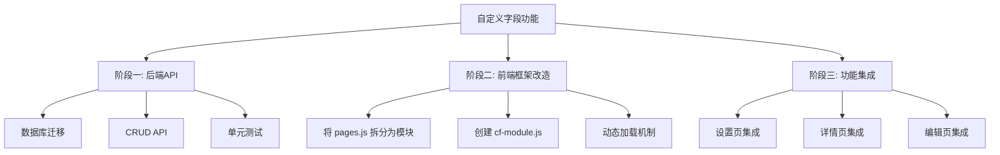

# 自定义字段功能分析报告

**日期：** 2026年4月20日  
**状态：** ❌ 已放弃（技术复杂度高，需重新设计）  
**负责人：** 国军

## 一、功能目标

### 业务需求
在现有BOM管理工具（零件/部件）的基础上，增加用户可自定义的附加字段功能，用于记录业务特定信息。

### 核心特性
1. **字段定义**：管理员可定义字段名称、类型（文本/数字/单选）、是否必填、适用对象（零件/部件/两者）
2. **数据存储**：字段值随实体保存，支持查询和筛选
3. **界面展示**：
   - 设置页：字段定义管理界面
   - 详情页：只读展示自定义字段值
   - 编辑页：表单输入控件

## 二、技术实现尝试（2026-04-20）

### 2.1 后端架构设计
已完成以下组件设计：

| 组件 | 说明 | 完成状态 |
|------|------|----------|
| 数据库表 `custom_fields` | 存储字段定义（name, field_type, options, is_required, applies_to） | ✅ 设计完成 |
| Pydantic Schema | `CustomFieldBase`, `CustomFieldCreate`, `CustomFieldUpdate` | ✅ 设计完成 |
| SQLAlchemy 模型 | `CustomField` ORM 模型 | ✅ 设计完成 |
| FastAPI 路由 | `GET/POST/PUT/DELETE /api/custom-fields/` | ✅ 设计完成 |
| 数据库初始化 | `initdb/custom_fields.sql` 建表语句 | ✅ 设计完成 |

### 2.2 前端架构设计
计划的三层注入点：

| 注入点 | 位置 | 功能 | 完成状态 |
|--------|------|------|----------|
| 设置页子选项卡 | `settings: function(c)` | 字段定义管理表格 | ⚠️ 部分完成 |
| 详情页区块 | `_viewPart`, `_viewComp` | 只读展示字段值 | ❌ 未实现 |
| 编辑页表单 | `_editPart`, `_editComp` | 表单输入控件 | ❌ 未实现 |

### 2.3 实际实施过程

#### 第一阶段：后端基础代码创建
- ✅ 创建 `backend/app/routers/custom_fields.py`
- ✅ 创建 `backend/app/schemas_custom_fields.py`  
- ✅ 修改 `backend/app/models.py` 添加 `CustomField` 模型
- ✅ 修改 `backend/app/main.py` 导入路由
- ✅ 修改 `backend/app/routers/__init__.py` 导出路由
- ✅ 创建 `initdb/custom_fields.sql` 建表语句

#### 第二阶段：前端设置页注入
- ✅ 在 `settings` 函数中插入 `_cfDefs` 数组变量定义
- ✅ 在 `settings` 函数中插入 `CF_CARD_HTML` 变量（包含完整表格HTML）
- ❌ **关键问题**：在 `c.innerHTML` 字符串拼接中插入 `CF_CARD_HTML` 变量时出现语法错误

## 三、遇到的核心技术问题

### 3.1 前端字符串拼接复杂度
**问题描述**：  
`frontend/js/pages.js` 为单文件压缩的SPA，所有函数代码均为单行字符串拼接。向 `c.innerHTML` 链中插入新变量时，需确保：
1. 引号正确配对（单引号/双引号）
2. 换行符正确处理（`\n` 转义）
3. 字符串连接符 `+` 位置正确

**具体错误**：
```javascript
// 目标结构
c.innerHTML = 
  '<div>...</div>' + 
  CF_CARD_HTML + 
  '\n<div class="card"...>' + 
  ...;

// 实际插入后出现语法错误：
// 1. 多余/缺失的引号
// 2. 未闭合的字符串字面量
// 3. 无效的换行转义
```

### 3.2 多层级转义规则冲突
| 层级 | 转义规则 | 冲突表现 |
|------|----------|----------|
| Python 脚本 | `\\n` → 字面量 `\n` | 写入文件时需生成正确的字节序列 |
| JavaScript 源码 | `\n` → 字符串中的换行符 | Node.js 解析时的语法检查 |
| HTML 内容 | `&lt;` → `<` | 无需额外转义，但需确保引号正确 |
| 最终渲染 | 实际换行显示 | 浏览器正确解析多层转义 |

**根本原因**：在已压缩的 `pages.js` 中进行字节级修改时，难以同时满足所有层次的转义要求。

### 3.3 调试困难
1. **浏览器缓存**：修改后需强制刷新（Ctrl+Shift+R）才能看到变化
2. **错误定位**：`Pages is not defined` 错误表明整个 `pages.js` 因语法错误而无法加载
3. **快速验证**：需通过 `node --check` 验证语法，但该检查对转义问题不够敏感

## 四、经验教训

### 4.1 架构设计层面
1. **避免修改压缩文件**：单文件压缩的SPA不适合直接注入复杂功能
2. **前后端分离**：应先确保后端API完备，再实现前端
3. **渐进增强**：应从简单功能开始，逐步增加复杂度

### 4.2 技术实施层面
1. **转义处理**：应在更高抽象层处理（如模板引擎），而非字节层
2. **模块化**：应将自定义字段UI封装为独立模块，通过动态加载引入
3. **测试驱动**：应先编写测试验证API，再实现集成

### 4.3 项目管理层面
1. **评估复杂度**：自定义字段功能涉及数据库、API、路由、前端渲染链，属于高级功能
2. **合理分段**：应拆分为多个子任务，分阶段实施
3. **风险评估**：直接修改生产代码的风险较高，应有回滚计划

## 五、未来实现建议

### 5.1 推荐方案（模块化改造）


### 5.2 具体实施步骤

#### 第一阶段：后端先行
1. 创建数据库迁移脚本（确保与现有数据兼容）
2. 实现完整的CRUD API（`/api/custom-fields/`）
3. 编写API测试脚本，确保基础功能可靠
4. 部署到测试环境验证

#### 第二阶段：前端框架改造
1. 将 `pages.js` 拆分为多个模块（需评估工作量）
2. 创建 `cf-module.js` 独立模块，包含：
   - 字段定义管理UI
   - 字段值渲染组件
   - 表单输入组件
3. 通过动态加载机制引入模块

#### 第三阶段：功能集成
1. 在设置页添加"自定义字段"选项卡，加载管理UI
2. 修改详情页模板，增加字段值展示区块
3. 修改编辑页表单，动态生成输入控件
4. 全面测试（兼容性、性能、用户体验）

### 5.3 备选方案（渐进增强）
如果模块化改造工作量过大，可考虑以下渐进方案：

1. **仅后端API**：先实现字段定义和值存储API，前端通过独立页面管理
2. **独立管理界面**：创建单独的 `/custom-fields.html` 页面进行管理
3. **只读展示**：先在详情页展示字段值，暂不支持编辑
4. **逐步集成**：待技术栈稳定后，再逐步集成到主界面

## 六、风险评估

| 风险项 | 可能性 | 影响程度 | 缓解措施 |
|--------|--------|----------|----------|
| 前端注入引发语法错误 | 高 | 高 | 采用模块化方案，避免直接修改压缩文件 |
| 数据库迁移失败 | 中 | 高 | 充分测试迁移脚本，准备回滚方案 |
| 性能影响（大量字段） | 低 | 中 | 实现分页加载、懒加载机制 |
| 用户使用复杂度高 | 中 | 中 | 提供默认字段模板、批量操作功能 |
| 与现有功能冲突 | 低 | 高 | 充分测试集成场景，确保向后兼容 |

## 七、结论与建议

### 7.1 技术结论
自定义字段功能在技术上是可行的，但**不适合在当前架构下直接实现**。主要障碍在于：
1. 单文件压缩SPA的修改复杂度高
2. 多层转义规则难以一次性调试通过
3. 功能边界容易蔓延，导致项目失控

### 7.2 项目建议
1. **暂停当前实现路径**：今日尝试证明直接修改 `pages.js` 的路径不可行
2. **优先进行架构优化**：考虑将 `pages.js` 拆分为模块化结构
3. **分阶段实施**：按照"后端先行 → 框架改造 → 功能集成"的路线图推进
4. **安排专门开发周期**：此功能需要连续、专注的开发时间，不宜碎片化实施

### 7.3 后续行动
1. 将本报告归档至项目文档
2. 在项目需求清单中标记此功能为"待架构优化后实现"
3. 下次评估时，优先考虑前端架构改造方案

---

**文档版本记录**
- v1.0 (2026-04-20): 初版，基于今日开发经验总结

**相关文档**
- [网页版BOM管理工具需求功能清单.md](./网页版BOM管理工具需求功能清单.md)
- [项目说明.md](./项目说明.md)
- 各日开发总结文档